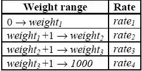

# Air Express

## Description

Fly It Today! (FIT), an air express company, charges different amounts for packages depending on their weight. For example, one set of rates may be:


 | Package weight | Cost per pound |
 | ------- | ------- |
 | 0 to 9 pounds   | $10 |
 | 10 to 49 pounds | $5 |
 | 50 to 99 pounds | $3 |
 | 100 pounds or more | $2 |


This rate structure has upset some customers who have realized that it costs less to ship a 10pound package ($50) than an 8 pound package ($80) and it costs less to ship a 100 poundpackage ($200) than a 90 pound one ($270).  FIT wants to check packages to determine if the customer can pay a lower price by adding weight to the package. If this is the case, they want to know the minimum weight to be added to obtain the lowest price possible.

## Input

The input file will have one or more data sets. Each data set begins with exactly 4 lines, giving the shipping rates. These will be:

```
weight1 rate1

weight2 rate2

weight3 rate3

rate4
```

You may assume all of these values are positive integers less than 1001 and weight1 < weight2 < weight3 . The values represent the rate table below:



There will then be 1 or more lines of customer package sizes. Each of these will be a positive integer less than 1001. The end of customer package sizes is indicated by the single integer 0.
The end of input will be indicated by end of file.

## Output

For each input set, print the input set number. Then, for each of the customer package sizes in the input set, create a line of output formatted as follows:

```
Weight (<w>) has best price $<price> (add <p> pounds)

Where <w> is the weight of the customer package, as defined in the input set, <price> is the lowest price the customer can pay to send that package (with, optionally, added weight) based on the input set shipping rates, and <p> is the number of pounds to be added to the package to obtain the price (<p> must be greater than or equal to 0). If more than one different weight results in the best possible price, use the smaller weight.

Have a blank line after the output for each input set.
```

## Sample Input

```
9 10
49 5
99 3
2
8
10
90
100
200
0
10 10
20 20
30 30
100
1
12
29
50
0
```

## Sample Output

```
Set number 1:
Weight (8) has best price $50 (add 2 pounds)
Weight (10) has best price $50 (add 0 pounds)
Weight (90) has best price $200 (add 10 pounds)
Weight (100) has best price $200 (add 0 pounds)
Weight (200) has best price $400 (add 0 pounds)

Set number 2:
Weight (1) has best price $10 (add 0 pounds)
Weight (12) has best price $240 (add 0 pounds)
Weight (29) has best price $870 (add 0 pounds)
Weight (50) has best price $5000 (add 0 pounds)
```
