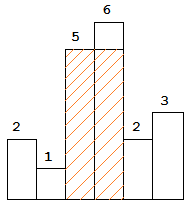

# 直方图最大面积

## Description

在统计中我们常常需要用到直方图。

我们可以经常看到这样的新闻：某地连续6个月降水量超过30mm之类。这样我们可以知道此地至少累计降过180mm的水。现在假设我们想弄个大新闻，现在有若干个每月降水的数据，我们可以知道某次连续x个月的降水量至少是 y，我们的目的是求出最大的x*y。

或者说，现在给出n个正整数代表直方图的高度，求出这个直方图的最大矩形面积，矩形需满足其中一条边在底轴上。如下图，可知其最大面积为 10。



## Input

第一行为一个整数T，表示数据的个数。

接下来T组数据，第一行是一个数N，第二行是N个数。

a1,a2,..,an，表示直方图从左至右的高度。

1 <= n <= 1000。

n 总和不超过四万。

1 <= ai <= 10000。

## Output

一个数据一行，表示能获得的最大面积。

## Sample Input

```
2
6
2 1 5 6 2 3
4
1 2 3 4
```

## Sample Output

```
10
6
```
