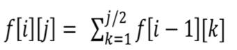

# Solution

可用动态规划算法解决，首先要找到递推式。

解法 1：设 f[i][j] 为幸运序列的数量，其中 i 为序列中数字的个数，j 为序列中最后一个数（也即从 [1, j] 中选出 i 个数形成幸运序列）。那么，题目中需要的结果就是 sum(f[N][1], f[N][2], ... , f[N][M])。为了求出结果，可先求出基本子问题 f[1][k] (1 <= k <= M)， 即序列中只有一个数字的情况。随后利用递推式自底向上求出序列中有 2 个数的情况、序列中有 3 个数的情况... 最终求出序列中有 N 个数的情况。此解法的复杂度为 O(N * (M ^ 2))。

解法 2：从解法 1 继续延申。注意到解法 1 中的递推式是个前缀和，可利用这一点进行优化。不妨令记 s[i][j] 为序列中数字的个数为 i 且最后一个数**不超过** j 的幸运数列的数量。此时有递推式 s[i][j] = s[i][j - 1] + f[i][j]，而 f[i][j] = s[i - 1][j / 2]。可同样采用自底向上的递推法求解，但是比解法 1 少了一层循环。此解法增加了空间复杂度，但是时间复杂度降为 O(N * M)。
