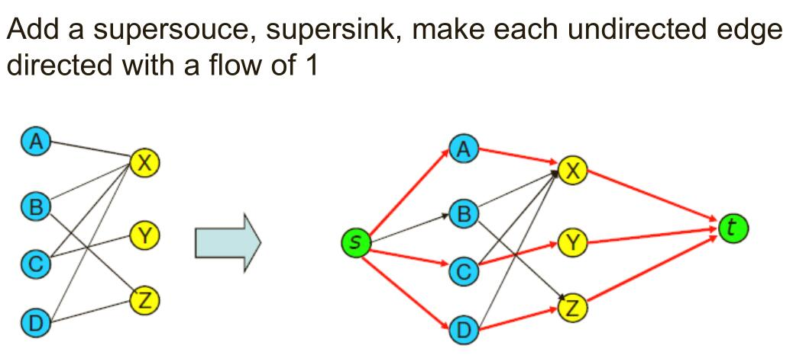

# Solution

这是一个二分图匹配（Bipartite Matching）问题，可用最大流算法解决，此处使用 Ford-Fulkerson 算法。图中有 N 个女生，M 个男生，再加上起点 s 和终点 t，则图中共有 N + M + 2 个节点。其中，起点 s 能连接所有女生，所有男生都能连接到重点 t。设置一个矩阵存储这些关系，并将每条边的容量都设为 1，再求出最大流即可得到最大匹配数。

