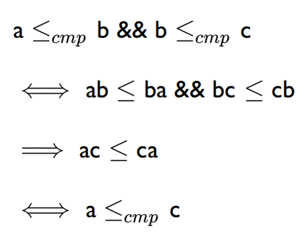

# Solution

版本 1：首先用 sort 算法重排输入的子字符串序列，再用 STL 提供的排序算法 next_permutation 枚举所有可能的排列，最后通过拼接和比较找到字典序最小的组合字符串。

版本 2：与版本 1 类似，只是将 next_permutation 换成自己实现。

版本 3：修正 sort 中的比较函数，运用贪心思想求解。这类贪心算法需要证明其传递性：若a <(cmp) b，b <(cmp) c，那么a <(cmp) c。

