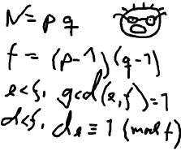

# The Embarrassed Cryptography

## Description

The young and very promising cryptographer Odd Even has implemented the security module of a large system with thousands of users, which is now in use in his company. The cryptographic keys are created from the product of two primes, and are believed to be secure because there is no known method for factoring such a product effectively.

What Odd Even did not think of, was that both factors in a key should be large, not just their product. It is now possible that some of the users of the system have weak keys. In a desperate attempt not to be fired, Odd Even secretly goes through all the users keys, to check if they are strong enough. He uses his very poweful Atari, and is especially careful when checking his boss' key.



## Input

The input consists of no more than 20 test cases. Each test case is a line with the integers 4 <= K <= 10100 and 2 <= L <= 106. K is the key itself, a product of two primes. L is the wanted minimum size of the factors in the key. The input set is terminated by a case where K = 0 and L = 0.

## Output

For each number K, if one of its factors are strictly less than the required L, your program should output "BAD p", where p is the smallest factor in K. Otherwise, it should output "GOOD". Cases should be separated by a line-break.

## Sample Input

```
143 10
143 20
667 20
667 30
2573 30
2573 40
0 0
```

## Sample Output

```
GOOD
BAD 11
GOOD
BAD 23
GOOD
BAD 31
```
